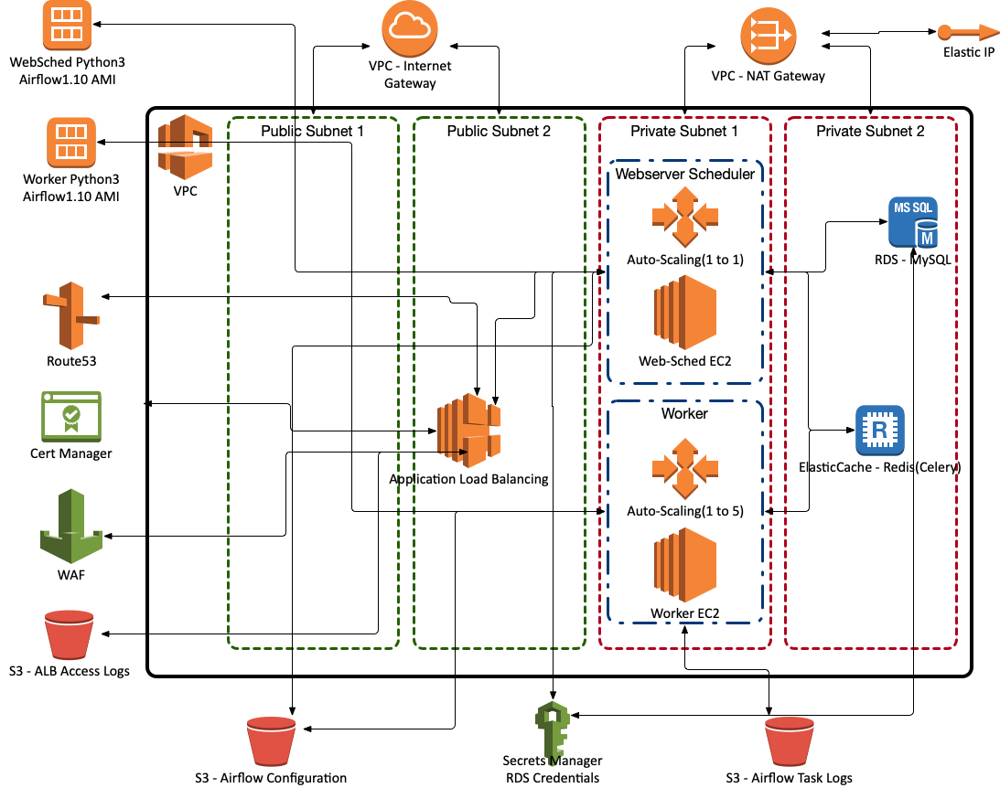

# What is this

This repo is an attempt to put all the Airflow operationalized knowledge at Turner into one place.  

Before trying to run this please take a look at the documentation here:  http://airflow.incubator.apache.org/index.html

Currently there are 2 AMI's(AWS) and 2 Cloud Images(GCP) that need to be created via Packer initially(Airflow(Python 3.x) before you can create the Airflow stack via Terraform.  

Here's our current stack:

**AWS(most work has been done here)**

**GCP(work in progress with less work since Composer exists there)**

DIAGRAM TO COME

**Docker(work in progress)**

DIAGRAM TO COME

Please feel free to add any issues to github.
